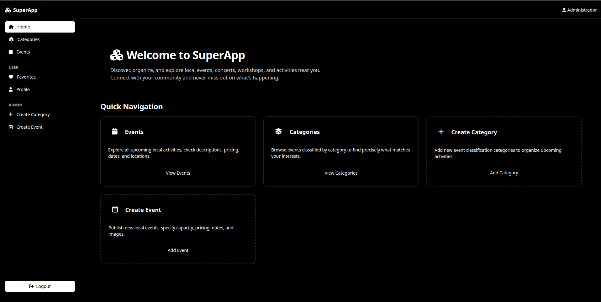

# Performance-test-react

<p align="center">
  
  
  
  
  
  
  
</p>

# SuperApp - Local Events & Activities Frontend

<p align="center">
  
</p>

A Single Page Application built to consume the SuperApp REST API (NestJS + PostgreSQL). Designed for discovering and organizing local events, concerts, workshops, and sports activities with role-based access control.

---

## Description

SuperApp allows users to explore local events and categories, manage favorites, register accounts, and securely log in. Administrators have exclusive capabilities to create, edit, and delete categories and events directly from the interface with real-time feedback and strict route protection.

---

## Technologies Used

- React + Vite - UI library and high-performance bundler
- TypeScript - static typing for safety and robust API integration
- TailwindCSS - utility-first styling and component design
- React Router - client-side routing with protected routes and role guards
- Axios - HTTP client with automatic request interceptors and error handling
- Vitest & React Testing Library - unit and integration testing suite

---

## Installation

Clone the repository:

```bash
git clone https://github.com/Zerik-Official/Performance-test-react
cd Performance-test-react
```

Install dependencies:

```bash
npm install

# copy de .env.example to .env
cp .env.example .env
```

---

## Running the Project

To start the development server:

```bash
npm run dev
```

The application will be available at http://localhost:5173. Ensure your backend API is running locally or configured via environment variables.

---

## Running Tests

To run the unit and integration tests:

```bash
npm test
```

---

## Test Admin User (Seeded by Backend)

| Email | Password | Role |
| --- | --- | --- |
| admin@examen.com | Admin123! | admin |

(Regular users can register directly from the application interface at /auth/register).

---

## Project Structure

```
├── components.json
├── eslint.config.js
├── index.html
├── package.json
├── package-lock.json
├── public
│   ├── favicon.svg
│   └── icons.svg
├── README.md
├── src
│   ├── app
│   │   ├── providers
│   │   │   └── AppProviders.tsx
│   │   └── router
│   │       ├── guards
│   │       │   ├── GuestGuard.tsx
│   │       │   ├── ProtectedRoute.tsx
│   │       │   └── RoleGuard.tsx
│   │       └── index.tsx
│   ├── App.tsx
│   ├── components
│   │   └── ui
│   │       ├── alert-dialog.tsx
│   │       ├── button.tsx
│   │       ├── input.tsx
│   │       ├── spinner.tsx
│   │       └── textarea.tsx
│   ├── features
│   │   ├── auth
│   │   │   ├── pages
│   │   │   │   ├── Login.tsx
│   │   │   │   ├── Register.tsx
│   │   │   │   └── __tests__
│   │   │   │       └── Login.test.tsx
│   │   │   └── services
│   │   │       └── authService.ts
│   │   ├── categories
│   │   │   ├── pages
│   │   │   │   ├── CreateCategory.tsx
│   │   │   │   └── ViewCategory.tsx
│   │   │   └── services
│   │   │       └── categoryService.ts
│   │   ├── events
│   │   │   ├── pages
│   │   │   │   ├── CreateEvents.tsx
│   │   │   │   └── Events.tsx
│   │   │   └── services
│   │   │       └── eventsService.ts
│   │   ├── favorites
│   │   │   ├── pages
│   │   │   │   └── Favorites.tsx
│   │   │   └── services
│   │   │       └── favoriteService.ts
│   │   ├── home
│   │   │   └── pages
│   │   │       └── Home.tsx
│   │   └── profile
│   │       ├── pages
│   │       │   └── Profile.tsx
│   │       └── services
│   │           └── profileService.ts
│   ├── main.tsx
│   └── shared
│       ├── api
│       │   ├── client.ts
│       │   └── env.ts
│       ├── components
│       │   ├── ErrorBoundary.tsx
│       │   ├── layout
│       │   │   ├── Header.tsx
│       │   │   ├── Layout.tsx
│       │   │   └── Sidebar.tsx
│       │   └── ui
│       │       ├── button.tsx
│       │       ├── card.tsx
│       │       ├── confirmDialog.tsx
│       │       ├── dialogForm.tsx
│       │       └── input.tsx
│       ├── constants
│       │   ├── roles.ts
│       │   └── routes.ts
│       ├── context
│       │   ├── AuthContext.tsx
│       │   └── ToastContext.tsx
│       ├── hooks
│       │   └── useFetch.ts
│       ├── lib
│       │   └── sessionStore.ts
│       ├── services
│       ├── styles
│       │   └── index.css
│       ├── types
│       │   ├── api.ts
│       │   ├── auth.ts
│       │   ├── category.ts
│       │   ├── events.ts
│       │   ├── favorite.ts
│       │   ├── pagination.ts
│       │   └── user.ts
│       └── utils
│           ├── cn.ts
│           ├── errors.ts
│           └── __tests__
│               └── validators.test.ts
├── tsconfig.app.json
├── tsconfig.json
├── tsconfig.node.json
└── vite.config.ts
```

---

## Role Permissions

| Feature | Visitor (No login) | User (user) | Admin (admin) |
| --- | --- | --- | --- |
| View events and categories | Yes | Yes | Yes |
| Mark/unmark favorites & view "My Favorites" | No | Yes | Yes |
| Create, edit, delete categories | No | No | Yes |
| Create, edit, delete events | No | No | Yes |

---

## Technical Decisions

* HTTP Client: Axios was chosen over fetch due to its native support for interceptors, allowing automatic attachment of the accessToken headers to secure endpoints and streamlined global interception of 401 unauthorized responses to clear expired sessions cleanly.
* Routing & Role Protection: Implemented custom guards (ProtectedRoute and RoleGuard) paired with React Router to achieve real-time redirection on unauthorized URL direct access, ensuring non-admin users cannot access administrative views or endpoints.
* Error Handling: Implemented a comprehensive error classification system distinguishing network errors, validation failures (400), and authorization constraints (401/403), paired with visual toast notifications and an application-level ErrorBoundary to prevent white screens of death.
* State Persistence: Session state (accessToken and user info) is synchronized securely using custom wrapper utilities over browser storage (localStorage/sessionStorage).
* Testing Strategy: Pure utility functions are validated with unit tests using Vitest, while component integration (such as the login form workflow) is tested using React Testing Library and user-event simulators.

## SuperApp Architectural Overview & Component Decisions

* **Design System / UI Components**: Built on top of customized Radix-primitive-style accessible components (`card.tsx`, `confirmDialog.tsx`, `dialogForm.tsx`, `input.tsx`, `spinner.tsx`, `textarea.tsx`), styled entirely via **Tailwind CSS** for lightweight utility-first consistency and high responsiveness.
* **Modular Feature-First Architecture**: Organized code inside `src/features/` by domain boundaries (`auth`, `categories`, `events`, `favorites`, `home`, `profile`), keeping feature-specific pages, components, and services localized while sharing global logic, types, and UI primitives via `src/shared/`.
* **Routing & Guard Layer**: Structured cleanly within `src/app/router/` using custom route guards (`GuestGuard`, `ProtectedRoute`, `RoleGuard`) to enforce strict separation between public visitors, authenticated users, and administrative roles.
* **Centralized API & State Management**: Leverages a robust Axios client wrapper with automatic token injection via interceptors, paired with React Context (`AuthContext`, `ToastContext`) for seamless global state distribution, session persistence, and instant feedback loops.